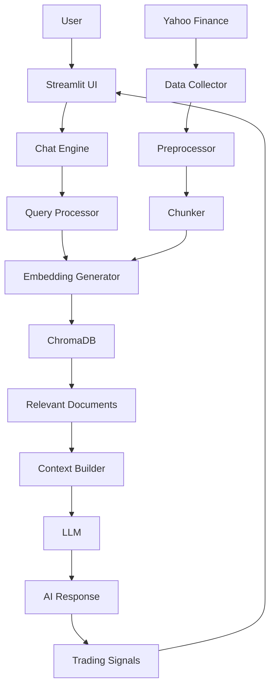

# 📈 TradingRAG Pro – Financial Research AI Assistant

<div align="center">


**🚀 AI-Powered Financial Research & Trading Intelligence Platform**

[Demo](#-demo) • [Features](#-features) • [Quick Start](#-quick-start) • [Architecture](#-architecture) • [Configuration](#-configuration) • [Roadmap](#-roadmap) • [Support](#-support)

</div>

---

## 🌟 Overview

**TradingRAG Pro** is a modern, **100% FREE**, AI-powered financial research and trading intelligence assistant built using **Retrieval-Augmented Generation (RAG)**.

It combines real-time market data, vector-based semantic search, and large language models to deliver **context-aware financial insights**, risk analysis, and trading signals—capabilities traditionally reserved for institutional-grade tools.

The platform is designed to be:

* **Open-source**
* **Privacy-first**
* **Fast and extensible**
* **Beginner-friendly, yet powerful for advanced users**

---

## 🎯 Key Highlights

* 💰 **Completely Free** – No paid APIs or subscriptions required
* 🤖 **Advanced AI Reasoning** – Powered by Groq LLaMA models or local Ollama
* 📊 **Live Market Data** – Yahoo Finance integration
* 🔍 **Semantic Search (RAG)** – ChromaDB + embeddings
* 🎨 **Professional UI** – Streamlit-based dark UI
* ⚡ **Low Latency** – Sub‑3s responses with Groq
* 🔒 **Local-First Option** – Fully offline with Ollama

---

## 📸 Demo

### Main Dashboard

<div align="center">
  <table>
    <tr>
      <td></td>
      <td></td>
    </tr>
    <tr>
      <td align="center"><b>AI Chat Analysis</b></td>
      <td align="center"><b>Market Overview</b></td>
    </tr>
  </table>
</div>

> 🎥 **Video Demo:** *Coming soon*

---

## ✨ Features

### 🤖 AI‑Powered Financial Intelligence

* Natural language financial queries
* Multi‑document RAG across filings, news, and summaries
* Follow‑up questions with conversational memory
* Bullish / bearish signal extraction
* Context‑aware reasoning grounded in real data

### 📊 Market & Company Analysis

* Company fundamentals (market cap, P/E, margins)
* Earnings and growth summaries
* Automated risk factor analysis
* Historical price data and trends

### 🎨 UI & Experience

* Dark glass‑morphism inspired UI
* Interactive charts and metrics
* Mobile‑friendly responsive layout

---

## 🏗️ Architecture

TradingRAG Pro follows a modular **RAG pipeline** optimized for financial workloads.



---

## 🚀 Quick Start

### ✅ Prerequisites

* Python **3.9+**
* 4GB RAM minimum (8GB recommended)
* Internet (Groq) **or** local Ollama install

---

### 📦 Installation

#### 1️⃣ Clone the Repository

```bash
git clone https://github.com/yourusername/TradingRAG-Pro.git
cd TradingRAG-Pro
```

#### 2️⃣ Create & Activate Virtual Environment

```bash
# Windows
python -m venv venv
venv\Scripts\activate

# macOS / Linux
python3 -m venv venv
source venv/bin/activate
```

#### 3️⃣ Install Dependencies

```bash
pip install -r requirements.txt
```

---

### 🔑 LLM Configuration

#### Option A: Groq (Recommended – Fast & Free)

1. Create a free API key at **console.groq.com**
2. Rename `.env.example` → `.env`
3. Update:

```env
GROQ_API_KEY=gsk_xxxxxxxxx
USE_OLLAMA=False
```

#### Option B: Ollama (100% Local)

```bash
ollama pull mistral
```

```env
USE_OLLAMA=True
OLLAMA_MODEL=mistral
```

---

### 📊 Load Data

```bash
python load_data.py
```

---

### ▶️ Run the App

```bash
streamlit run streamlit_app.py
```

Open: **[http://localhost:8501](http://localhost:8501)**

---

## 📁 Project Structure

```text
TradingRAG-Pro/
│
├── streamlit_app.py        # UI entry point
├── load_data.py            # Data ingestion & indexing
├── requirements.txt        # Dependencies
├── .env.example            # Environment template
│
├── config/
│   └── settings.py         # App configuration
│
├── data_collection/
│   ├── yahoo_collector.py
│   └── data_preprocessor.py
│
├── vector_db/
│   ├── chroma_manager.py
│   └── embeddings.py
│
├── llm/
│   ├── chat_engine.py
│   └── prompts.py
│
└── chroma_db/              # Local vector store
```

---

## 🔍 Usage Examples

**Risk Analysis**

> What are the biggest risks facing Tesla right now?

**Comparison**

> Compare Apple vs Microsoft fundamentals

**Momentum**

> Which tech stocks show bullish momentum this week?

---

## 🛠️ Configuration

Edit `config/settings.py` to tune performance:

| Setting           | Description     | Default                   |
| ----------------- | --------------- | ------------------------- |
| `LLM_MODEL`       | LLM used        | `llama-3.3-70b-versatile` |
| `EMBEDDING_MODEL` | Embeddings      | `all-MiniLM-L6-v2`        |
| `CHUNK_SIZE`      | Text chunk size | `500`                     |
| `MAX_TOKENS`      | Response length | `1024`                    |
| `TEMPERATURE`     | Creativity      | `0.7`                     |

---

## 🔧 Troubleshooting

**ModuleNotFoundError**

* Ensure virtual env is active
* Reinstall requirements

**Groq API Errors**

* Check API key
* Switch to smaller model

**ChromaDB Issues**

```bash
rm -rf chroma_db
python load_data.py
```

---

## 📈 Roadmap

* [x] Core RAG engine
* [x] Yahoo Finance integration
* [x] Groq / Ollama support
* [x] Trading signal extraction
* [ ] RSI / MACD indicators
* [ ] Candlestick charts
* [ ] Options analysis
* [ ] Crypto & Forex support
* [ ] Mobile app

---

## ⚠️ Disclaimer

This project is for **educational and research purposes only**.

* ❌ Not financial advice
* ❌ No investment guarantees
* ✔ Always do your own research

The authors assume **no liability** for financial outcomes.

---

## 🤝 Contributing

Contributions are welcome 🚀

1. Fork the repo
2. Create a feature branch
3. Commit changes
4. Open a pull request

---

## 📄 License

This project is licensed under the **MIT License**.

---

<div align="center">

**Made with ❤️ by the TradingRAG Team**

[⬆ Back to Top](#-tradingrag-pro--financial-research-ai-assistant)

</div>
